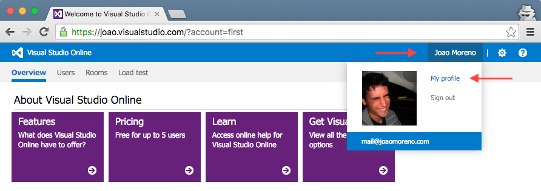

# Publishers

A **publisher** is the identity who publishes extensions to the Visual Studio Code
gallery. Every extension needs to include a `publisher` name in its [`package.json`
file](manifest.md).

## Gallery

Visual Studio Code leverages
[Visual Studio Online](https://www.visualstudio.com/products/what-is-visual-studio-online-vs)
for its gallery services. This means that authentication, hosting and
management of extensions is provided through that service.

`vsce` is able to authenticate against Visual Studio Online through
[Personal Access Tokens](https://www.visualstudio.com/en-us/news/2015-jul-7-vso.aspx).

### Get a Personal Access Token

First, login to or sign up for
[Visual Studio Online](https://www.visualstudio.com/en-us/get-started/setup/sign-up-for-visual-studio-online).

Then, from your account's home page `https://ACCOUNT.visualstudio.com`, go to
the **My Profile** page:



Switch to the **Security** tab and **Add** a new Personal Access Token:


Give the Personal Access Token a nice description, optionally extend its 
expiration date to 1 year and make it access every account:


The next screen will display your newly created Personal Access Token.

**Copy** it, you'll need it to create a publisher.

## Create a Publisher

Pick a publisher name and run:

```
vsce publisher create PUBLISHER_NAME
```

`vsce` will ask for a Personal Access Token to create the publisher with. It will
also remember it for future references to this publisher.

## Login to a Publisher

In case you already created a publisher before, you can simply run:

```
vsce publisher login PUBLISHER_NAME
```

Similarly to the `create` command, `vsce` will ask you for the Personal Access Token
and remember it for future commands.
